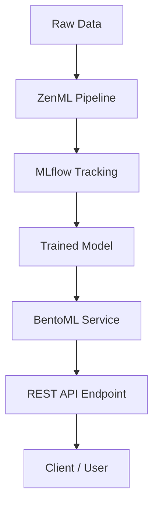

# 🏠 Advanced Real Estate Price Prediction MLOps Pipeline

An end-to-end **production-ready** machine learning pipeline to predict **California housing prices**, built using **ZenML**, **MLflow**, **BentoML**, and **GitHub Actions** — following modern **MLOps best practices**: CI/CD, model tracking, experiment management, scalable deployment, and robust monitoring.


---

## 🎯 Key Highlights

✅ **Modular ZenML pipelines** for ingestion, preprocessing, training, evaluation, and deployment

✅ **MLflow integration** for experiment tracking & model registry

✅ Train and compare **multiple models** (Linear, Ridge, Lasso, Random Forest)

✅ **Automated evaluation & comparison**

✅ **BentoML service** for real-time REST API predictions

✅ **Fully automated CI/CD** with GitHub Actions (linting, testing, deploying, rollback)

✅ **Code quality checks & health monitoring**

---

## 🧠 Tech Stack

| Tool           | Purpose                                |
| -------------- | -------------------------------------- |
| ZenML          | Pipeline orchestration                 |
| MLflow         | Experiment tracking & artifact logging |
| BentoML        | Model packaging, serving & API         |
| GitHub Actions | CI/CD automation                       |
| Scikit-learn   | ML models & preprocessing              |
| Pytest + Black | Testing & code formatting              |

---

## 🏛️ High-Level Architecture



---

## 📂 Project Structure

```plaintext
property-price-prediction/
├── src/
│   ├── data_loader.py
│   ├── feature_engineering.py
│   └── utils.py
├── steps/
│   ├── preprocessing.py
│   ├── model_trainer.py
│   ├── evaluator.py
│   └── deployment.py
├── bentoml/
│   ├── bentoml_service.py
│   └── bentofile.yaml
├── .github/
│   └── workflows/
│       └── mlops-pipeline.yml
├── zenml_pipeline.py
├── enhanced_zenml_pipeline.py
├── training_pipeline.py
├── requirements.txt
├── pyproject.toml
└── README.md
```

---

## ⚙️ Local Development

```bash
# 📥 1️⃣ Clone the repo & set up virtual environment
git clone https://github.com/priyanshumishra610/Advanced-Real-Estate-Price-Prediction.git
cd property-price-prediction
python -m venv venv && source venv/bin/activate  # Windows: venv\Scripts\activate
pip install -r requirements.txt

# 🔗 2️⃣ Initialize ZenML & run pipeline
zenml init
python zenml_pipeline.py
# or
python enhanced_zenml_pipeline.py

# 📊 3️⃣ Start MLflow UI for experiment tracking
mlflow ui --host 0.0.0.0 --port 5000
# Visit: http://localhost:5000

# 🚀 4️⃣ Serve REST API with BentoML
bentoml serve bentoml_service:PropertyPriceService
# Visit Swagger UI: http://localhost:3000
```

---

## 🔁 CI/CD Workflow

Automated **GitHub Actions** pipeline on each push:

✅ Code linting & formatting checks

✅ Unit tests with Pytest

✅ Run ZenML pipelines

✅ Build BentoML service

✅ Health checks

✅ Deploy on success

✅ Rollback on failure if needed

**Workflow:** `.github/workflows/mlops-pipeline.yml`

---

## 🌐 Roadmap

| Phase   | Description                                | Status         |
| ------- | ------------------------------------------ | -------------- |
| Phase 1 | Core ZenML pipelines, MLflow setup         | ✅ Completed    |
| Phase 2 | CI/CD integration with GitHub Actions      | ✅ Completed    |
| Phase 3 | BentoML deployment & serving               | ✅ Completed    |
| Phase 4 | Monitoring, scaling & cloud deployment     | 🚧 In Progress |
| Phase 5 | Extend with advanced models, feature store | 🗂️ Planned    |

---

## 💡 Future Enhancements

* Add **cloud-native orchestration** with Kubernetes & Helm
* Integrate **Prometheus + Grafana** for monitoring
* Use **Feast** for feature store management
* Build a **simple Streamlit dashboard** for user interaction

---

## 👨‍💻 Author

**Priyanshu Mishra**

> *“Building world-class AI pipelines with robust MLOps, one repo at a time.”*

🔗 [GitHub](https://github.com/priyanshumishra610)

---

## ⭐️ Support & Share

If you find this template valuable — **star ⭐️ it**, **share it**, and feel free to **fork & contribute!**

---

## 📄 License

**MIT License** — free for personal & commercial use.
**Use it. Improve it. Share it.**


